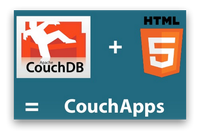
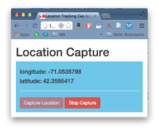
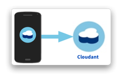
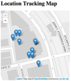
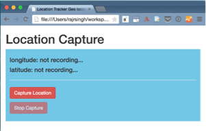
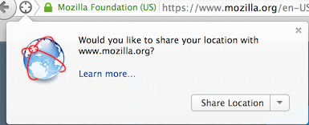
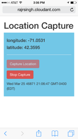
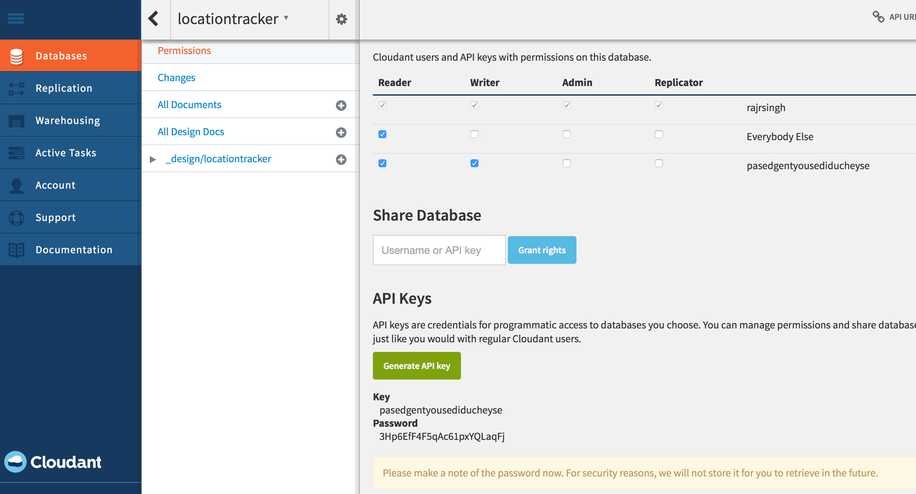

image:https://cloudant.com/wp-content/themes/cloudant/images/ibm_cloudant.png["IBM Cloudant"]

= Location Tracker Tutorial: Part 1
_Track & map things that move with HTML5, JavaScript & Cloudant_

In this tutorial, we'll build a mobile app in HTML5 and Javascript that records the device's location and saves it to Cloudant. Then we'll build a separate mapping app that reads location information from the Cloudant database and tracks those movements on a map in real time. Note that these two apps are completely separate. The movement tracking map could be mapping hundreds of devices that are storing their locations in the database, but it knows nothing about the actual devices out in the field. It's just reading location data from the database. The two apps will seem connected, however, because the updates occur so seamlessly. All the code for this tutorial can be forked from GitHub from https://github.com/cloudant-labs/location-tracker-couchapp[this repository]. 

This tutorial isn't very quick -- altogether it could take from 45 to 90 minutes to get through all the parts, depending on your prior experience with the technologies used. But in the end you'll see it's well worth the effort. Here are the steps we'll be going through. 

[cols="3",border="0"]
|===
|*Application layer setup:* to make Javascript data transfer easy, we'll put the app on the same server as the database. We'll take advantage of the fact that CouchDB and Cloudant contain a simple web server and write our code in a _CouchApp_. This is a technique to serve your HTML, Javascript, CSS and graphics right out of the database.
|_time estimate: 15 minutes_
|
|*Capturing location:* we'll utilize the HTML5 _Geolocation API_ to capture the device's location. Then we'll use _PouchDB_, a miniature CouchDB database implemented as a client-side Javascript library.
|_time estimate: 30 minutes_
|
|*Saving data to the cloud:* Next, we'll push our location data to a Cloudant database using the database replication capability built into Cloudant/CouchDB/PouchDB.
|_time estimate: 20 minutes_
|
|*Mapping real-time movement:* Finally, we'll build an app that pulls location data from Cloudant and puts these tracks on a map. This could be a mobile client, but is more likely to be something used in an operations center by someone needing an overview of the whole system.
|_time estimate: 20 minutes_
|
|===

== Step 1: Setup

=== Get a Cloudant Account
If you don't yet have one, you'll need a Cloudant account to do this exercise. It's free, so head on over to https://cloudant.com/sign-up/ and get one now. 

=== CouchApp Setup
We're going to write a very simple location recording client using modern Javascript and HTML5. We could accomplish this with a single, short web page that didn't require any special server platform other than your favorite HTTP server of choice. However, we'll eventually want to save the location data in Cloudant using Javascript, and we don't want to get into the complications of http://en.wikipedia.org/wiki/Cross-origin_resource_sharing[CORS (cross-origin resource sharing)], so we need to put our web page on the same server as our Cloudant database.  

The way to do this is to take advantage of the fact that Cloudant and CouchDB contain a simple web server in addition to their database serving capabilities. So we'll build our application as a CouchApp. A CouchApp is a methodology for packaging up a set of files for a web site -- HTML, CSS, Javascript and images -- and uploading them into your Cloudant/CouchDB database. The drawback to having no middle tier between the client and the database is that any authentication creditials you need for the database, such as passwords or API keys, must reside in the client, so the Couchapp strategy is inherently insecure and unfit for production apps, but they are great for tutorials like these. Especially since you can share the web site and the data by simply replicating the database. Just make sure you use the Python CouchApp as there are a few different strategies for laying out the files. Only the Python style referenced here will work for this tutorial. 

****
NOTE: _CouchApps are web applications served directly from CouchDB, mostly driven by JavaScript and HTML5. If you can fit your application into those constraints, then you get CouchDB's scalability and flexibility "for free" (and deploying your app is as simple as replicating it to the production server)._  -- http://docs.couchdb.org/en/latest/couchapp/[Couchdb.org]
****

All you should need to do is run the following at the command line:

 $ sudo easy_install --upgrade couchapp

If you got any errors from that command, or you'd just like more background on setting up a CouchApp, https://github.com/couchapp/couchapp[follow these instructions] and come back when you're done. Or for a more extensive CouchApp introduction, follow this excellent tutorial on IBM developerWorks, http://www.ibm.com/developerworks/opensource/tutorials/os-couchapp/[Building CouchApps]. 

_insert your favorite elevator music here…_ 

OK, great. Now you've got CouchApp set up and you're ready to start writing code. Get to a command line prompt in your favorite terminal emulator, and create the skeleton CouchApp with this command:

 $ couchapp generate app locationtracker

Now you will have a locationtracker directory with a host of directories in it. The first thing we'll want to do is tell the CouchApp where to deploy, so change to that directory and create (or update) a file called .couchapprc (note the “dot” at the beginning of the file name). Type the code in Listing 1 into that file, remembering to exchange the `$USERNAME` & `$PASSWORD` placeholders for your Cloudant account's username and password..

 $ cd locationtracker

.Listing 1. .couchapprc
[source,bash]
----
{
  "env": {
    "remote": {
      "db":"https://$USERNAME:$PASSWORD@$USERNAME.cloudant.com/locationtracker"
    }
  }
}
----

== Step 2: Logging location

=== User interface

Now we get to start writing code. In a CouchApp, all HTML files go in the _attachments directory, so cd there: 

 $ cd _attachments

and type Listing 2 into a file called `index.html` (you will probably need to replace the text in the existing file).

.Listing 2. HTML5 user interface
_file: index.html_
[source,html]
----
<!DOCTYPE html>
<html lang="en">
  <head>
	<meta charset="utf-8">
	<meta name="viewport" content="width=device-width, initial-scale=1">
	<title>Location Tracker Geo location demo</title>
	<link rel="stylesheet" href="//maxcdn.bootstrapcdn.com/bootstrap/3.2.0/css/bootstrap.min.css">
    <link rel="stylesheet" href="style/main.css" type="text/css">
  </head>
  <body>
  	

  		<h1>Location Capture</h1>
  		

  			<h4>longitude: not recording...</h4>
  			<h4>latitude: not recording...</h4>
  			

			

				
<button id="starter" class="btn btn-danger" 
                    onclick="startWatch()">Capture Location</button>

				
<button id="stopper" class="btn btn-danger" 
                    onclick="stopWatch()" disabled>Stop Capture</button>

				
<button id="saver" class="btn btn-danger" 
                    onclick="saveToServer()" disabled>Save to Cloudant</button>

			

			

  		

  	

  </body>
</html>
----

This is basic HTML to create some user interface elements to show the current coordinates of the device in the  elements with ids of “x” and “y”, and also to allow the user to start and stop location recording using the buttons with ids of “starter” and “stopper”.  The page should look something like Figure 1.

****
NOTE: Notice the stylesheet link in the <head> makes the app prettier and mobile-friendly by adding the Bootstrap CSS to the page. The app will work fine without it though.
****

=== Acquiring location
This page doesn't actually do anything until we add some Javascript goodness to it. We're going to be using http://www.w3.org/TR/geolocation-API/[the Geolocation API standard] defined by the http://www.w3.org[World Wide Web Consortium] and http://en.wikipedia.org/wiki/W3C_Geolocation_API#Deployment_in_web_browsers[implemented in all modern desktop and mobile browsers]. There are many http://diveintohtml5.info/geolocation.html[excellent] https://developer.mozilla.org/en-US/docs/Web/API/Geolocation/Using_geolocation[general-purpose] http://html5demos.com/geo[tutorials] on using the Geolocation API, so we won't delve into much background here. We'll just get started adding the code in Listing 3 to index.html right before the ending `</body>` tag. 

First, we check for geolocation support by checking for the existence of the variable `navigator.geolocation`. If geolocation support is available, we log a message to the console and wait for the user to act. If it's not, we alert the user and disable the button that would start recording location (since it wouldn't work anyway). 

Now that we know we can support location, we can trust that our app can run. Notice that the <button> tag with the id “starter” says to run the startWatch function when it's clicked. Look at the `startWatch` function in Listing 3. 

.Listing 3. Location capture Javascript
_file: index.html_
[source,html]
----
<!DOCTYPE html>
<html lang="en">
  <head>...</head>
  <body>
  
...

    
  </body>
</html>
----

When the user clicks the “Capture Location” button, we will:

. disable the button so we don't get multiple requests
. enable the “Stop Watching” button
. change the coordinate status to “updating…” so the user knows the app is acquiring the device's coordinates, and 
. most importantly, we kick off the request to continuously get the device's location with the `navigator.geolocation.watchPosition` request. 

That function takes two arguments -- the function to call when the position is updated, and the function to call when there's an error. It also returns an ID that can be used later to stop requesting the device's position, which we do in the stopWatch function with the command `navigator.geolocation.clearWatch`.

****
NOTE: *Respect your user's battery:* Requesting location _only when you really need it _is crucial with mobile apps so you don't drain the user's battery by keeping the GPS on constantly to service your location requests when you're not going to make use of it.
****

When the `navigator.geolocation.watchPosition` function runs, your browser will ask you if you agree to have your location shared with this web page. Different browsers will present different user interfaces for this, but here's what it looks like in Firefox:

You can test this out in your browser by opening the `index.html` file locally. If you decline to share your location, or some other error condition happens, the function `watchError` will be called. Otherwise, doWatch will be called with a position object as input to the function. The properties of this object are described in Listing 4.

Let's pause a second and give a shout out to the browser manufacturers for making our lives as web developers so simple. What's going on here is that the browser is going to interface with the hardware on whatever device it's running -- a phone, tablet, wearable, sensor, whatever -- and get a latitude/longitude reading using the best means available -- embedded GPS, WiFi triangulation, iBeacons, whatever -- and give that to you, the Javascript developer, in a nice consistent format the same way, every time. Sometimes standards efforts really get it right.

*Listing 4. The Geolocation position object*
|===
|*Property*|*Type*|*Notes*

|*coords.latitude*|double|decimal degrees
|*coords.longitude*|double|decimal degrees
|*coords.altitude*|double or null|meters above the reference ellipsoid
|*coords.accuracy*|double|meters
|*coords.altitudeAccuracy*|double or null|meters
|*coords.heading*|double or null|degrees clockwise from true north
|*coords.speed*|double or null|meters/second
|*timestamp*|DOMTimeStamp|like a Date() object
|===
Now let's take a close look at the `doWatch` function.  

As with most things in life, be it sports, house painting, or coding, the hard work is in the preparation, while the flashy stuff is easy. We've paid our dues with a lot of prep work learning how to make a CouchApp, laying out the UI properly, and handling error conditions. Now in doWatch (Listing 3) it all pays off as we get to work with the actual real coordinates of where the device is located.  

We will only make use of the longitude, latitude and timestamp properties, so in doWatch we save these to a JSON object -- the coords variable -- and display the longitude and latitude on the screen by setting the innerHTML property of our x and y s.  

Note that we don't just save the data as-is. We put them in a specially constructed JSON object that conforms to the http://geojson.org/geojson-spec.html[GeoJSON specification]. Cloudant has made this industry standard way of storing points, lines and polygons a cornerstone of its support for geographic data, which is on par with the most sophisticated geographic information systems available. By storing geographic data in Cloudant in GeoJSON format, you gain access to special geographic indexing and query functionality that you can't get in any other JSON data store. But that's a topic for another tutorial. Here we won't do anything fancy with geographic indexing or query, but later you'll see that supporting this standard makes mapping trivial.

Also note that we do a little math to round the GPS coordinates to 5 decimal places, and at the same time check to make sure we're not saving the same coordinates we captured last time through the function. These 2 things taken together ensure we only save coordinate changes that represent at least about a meter. That distance is good for changes to a walking pace. If you're going to be biking or driving you may want to modify the code to require a bigger change in coordinate values.

=== Road test
Let's test out what we have so far by deploying the CouchApp to Cloudant. If you've rummaged around inside the locationtracker directory, you've probably found a lot of other files that were put there by the generate script. We don't need those right now, but we can safely deploy and ignore them. In a real application, you'd want to make sure only the file that were absolutely necessary were included. To deploy the code to the server, run this command from the 'locationtracker' directory: 

 $ couchapp push . remote 

Let's briefly go through how this command works. `couchapp` is the main command. The rest of the line consists of arguments to the command. `push` means to copy code somewhere, and the . (dot) means the couchapp to copy is the current directory. `remote` means look in the  `.couchapprc` file (remember we created this early on) and find a resource with the name remote, and push the CouchApp to that database (creating the database if need be). 

Assuming everything went well, the response should be the URL at which you can access the app, such as:
$ http://$USERNAME.cloudant.com/locationtracker/_design/locationtracker/index.html 

Since you've deployed to the cloud, you can test the app from your phone right away. All you have to do is make the database -- and therefore the web site you just built -- publicly readable. To do that, go to your Cloudant dashboard via this URL: 

 $ https://$USERNAME.cloudant.com/dashboard.html
 
The main window shows you a table of your databases. You may only have one at this point -- `locationtracker`. Find the padlock icon to the right of your database name and click on it. You'll see that you have all permissions on this database, and "Everybody Else" has no access. Check the "Reader" box for "Everybody Else", and now your web app is live! Load the URL given to you by the couchapp push command, click the "Capture Location" button, and give permission to access your location. Figure 3 shows what it looks like on an iPhone. 

Congratulations! You've got some valuable location data from your user. Walk around a bit and watch the coordinates change. In fact, take a break and walk around your office or neighborhood. You've been meaning to get some exercise anyway, right? Just make sure to stop looking at your phone so you don't get run over by a car. 

=== Browser-based persistence with PouchDB
OK, walk over? Now that we have some great data, we'll want to save it so that we have a record of where the device has been. One of the killer features of Cloudant for mobile apps is online/offline synchronization. You can have your database on the device, _and_ on the server. The mobile device can be offline happily gathering data, then sync to the server when it gets a network connection, keeping the user's data in sync no matter where they next login. We'll implement the local, on-device database using http://www.pouchdb.com[PouchDB], because it's awesome, dead-simple, and pure Javascript. Then we'll tell PouchDB to replicate to Cloudant when the user presses a button.

****
NOTE: In version 4 of PouchDB, replicating whenever the device gets a network connection will be automatic, requiring no extra coding.
****

First, let's start storing the coordinates in the browser in PouchDB. Add PouchDB support by including the Javascript library in the web page, which you can do by putting this line right before your beginning  
----

Then, in your `
    
</body>
</html>
----

Now if you want, you can deploy this new code to the server and test your work: 

 $ couchapp push . remote 

There will be no visible difference from the last deploy (if everything is working correctly), but using your favorite Javascript debugger you should be able to see some interesting new stuff in the `db` object.

== Step 3: Saving data to the Cloud(ant)

The final step in our fleet tracking app is to persist the data collected to the server in our Cloudant database. First, we'll have to open up our database for writing. When we uploaded our CouchApp, we were actually writing to the database, but we were using our username and password for authentication. It would be very bad form to code your system-wide username and password into every app you wrote, so Cloudant provides a quick and easy way to generate an API key that an app can use to authenticate to a single database. You can give the holder of that key read, read/write, or full administrative access to the database. For our purposes, we'll need to generate a key and give it read/write access to the locationtracker database.  

Once again, go into the Cloudant dashboard by accessing this URL: 

 https://$USERNAME.cloudant.com/dashboard.html 

In your list of databases, find locationtracker and click on the padlock icon at the far right of the row. 

This will bring up a panel like that shown in Figure 3. Click on the “Generate API key” button on the far right, and in a few seconds you will have a new key with a funny name and password. It will automatically be given read permission to the database. Also check the Writer permission for this new programmatic user of your database. Write down the key and password as now shown to you. You will use it in place of username and password authentication in your app. Now you are ready to use this information in your app. 

PouchDB, along with the power of CouchDB replication, makes writing to the remote database incredibly simple. After this line where you initialize the local database: 

[source,html]
----
var db = new PouchDB('localdb'); 
----

add a line initializing the remote Cloudant database: 

[source,html]
----
var remotedb = 'https://$APIKEY:$APIPASSWORD@$USERNAME.cloudant.com/locationtracker'; 
----
 
Then add the `saveToServer` function shown in Listing 6 to your script. We also add some code to other functions to enable and disable the “Save” button when it makes sense. The code for the full HTML file is `_attachments/index.html` in the https://github.com/cloudant-labs/location-tracker-couchapp[GitHub repo for this tutorial].

The `saveToServer` function has one major PouchDB call, `replicate.to`. It's only argument is the database to replicate to, which we specified earlier. The anonymous functions that handle callbacks on the 'complete' and 'error' return values simply report to the user what is happening. 

.Listing 6: Saving coordinates to the server
_file: index.html_
[source,html]
----
<!DOCTYPE html>
<html lang="en">
  <head>...</head>
  <body>
  
...

    
</body>
</html>
----

Finally, let's give the user a way to start synchronization/replication. To do this we'll add a new “Save” button to the user interface. As mentioned earlier, a more elegant solution would be to have replication happen whenever the client was online without requiring any action by the user (or developer). That is possible today with more complex coding, and in future PouchDB releases it will get simpler, but for the purposes of this tutorial we'll just handle the process with brute force user interaction. 

Add the “Save” button to the web page by putting this HTML after the “Stop” button: 

[source,html]
----
<button id="saver" class="btn btn-danger" onclick="saveToServer()" disabled>Save</button>
----

Now redeploy your app by pushing the couchapp to the server and do some field testing. Remember you have to use all 3 buttons in order: "Capture Location" to start recording locations; "Stop Capture" (as a check to make sure you don't log data forever); and "Save to Cloudant" to put the location data into the database. Make sure it all worked by going back to the Cloudant dashboard and looking at your database. There should be ten or so documents in there now.

== Step 4: Mapping real-time movement
We now have a pretty nice application to track the location of any moving device that supports Javascript and the Geolocation API. But a location tracking tutorial wouldn't be complete without ultimately seeing the data on a map. So let's make a second app that displays location data from Cloudant. This app will work for any point data you have in a Cloudant database -- customers, stores, etc. -- not just location tracking data, so you should find this code useful in the future.

We'll once again use PouchDB as our local in-browser database, and it will once again replicate with Cloudant. The really cool thing about this is that PouchDB can “listen” for updates to the Cloudant database, and automatically add those new locations to the map as they happen, which results in a pretty slick real-time geographic view of changing events. Thanks to the architecture of CouchDB, we can now do this with just a few lines of code, whereas just a few years ago this kind of application would be very complex, and only feasible for government applications like military “war rooms” and emergency operations centers responding to major natural disasters. 

The code for the real-time map is shown in Listing 7. Let's step through it from top to bottom.  

Most of the sophisticated mapping functionality is handled by the excellent Javascript mapping library, http://leafletjs.com/[Leaflet]. We include the library right after including the PouchDB library. Leaflet also needs a little CSS for its mapping interface, so we include that in the `<head>` as well. 

Now we'll create our user interface. Leaflet handles all the mapping components, so let's just give Leaflet a `
` to work with. We'll give it the id of “map” and set it to be 400 pixels square. 

The next interesting thing we do is set up a PouchDB database. We're going to do something a little different that we did in our data collection app. Here, instead of creating a local, self-contained database that can run offline, we use PouchDB as basically a convenience API to request data from Cloudant and retrieve real-time updates as the database is modified. 

****
NOTE: *Cloudant and real-time updates*
One area where Cloudant/CouchDB excels is in its ability to synchronize changes between databases. Leveraging the database's change feed, clients can poll for database updates and pull down only the small amount of information that has changed since the last update.
****

We  define our PouchDB database to be remote. This time we don't need to use our API key because we're only reading, and we set the database up to be world-readable earlier. Then, with the db.changes function, we tell PouchDB to “listen” for changes and call the updateMovingLayer function whenever a change occurs. It's hard to underestimate how cool this little function is. In one line of code we've established a local copy of our database as well as a way to get real-time updates!

.Listing 7: Real-time mapping
_file: map.html_
[source,html]
----
<!DOCTYPE html>
<html lang="en" class="no-js">
<head>
	<meta charset="utf-8" />
	<meta name="viewport" content="width=device-width, initial-scale=1">
	<title>Location Tracking Map</title>
	<link rel="stylesheet" href="//maxcdn.bootstrapcdn.com/bootstrap/3.2.0/css/bootstrap.min.css" 
        type="text/css" />
	<link rel="stylesheet" href="//cdnjs.cloudflare.com/ajax/libs/leaflet/0.7.3/leaflet.css" 
		type="text/css" />
</head>
<body>
	

		<h1>Location Tracking Map</h1>
		

	

	
 	
	
	
</body>
----

The next thing we do is initialize the map with this line of code: 

[source,javascript]
----
var map = L.map('map').setView([42.36, -71.1], 10); 
----

This is a call to the Leaflet library. The `L.map` constructor takes as its only required argument the id of the HTML DOM element in which to draw the map. The `setView` function starts the map off with a view of downtown Boston, Massachusetts (right next to "Cloudant World Headquarters" by the way) by specifying a center point of 42.36, -71.1 and a zoom level of 10. You can set this to anywhere you'd like as we'll make the map move to just show our device locations as soon as we get data from the server. 

Now we'll add geographic data to the map. The `L.tileLayer` command adds a basic street map so that our device locations aren't floating on a blank background. The movementLayer variable is defined as a http://geojson.org[GeoJSON] layer. We initialize it with an empty constructer -- `L.geoJson()` -- meaning there's no data in the layer yet, and add it to the map. We'll add data to it as we receive changes from the Cloudant database through that `updateMovingLayer` callback function we set up with the PouchDB `changes` function. 

The final piece of magic is the `updateMovingLayer` function, which gets called when any document in the Cloudant database changes. The input argument is a JSON document that contains the document that has changed along with some metadata about the change.  

Above it was mentioned that we will display our device location data on the map using a GeoJSON layer. The good news is that the Leaflet community has already built support for adding GeoJSON data to a map, so Cloudant's support for this standard really pays off here. All we have to do is add the change document to the map with no extra data massaging with the command `movementLayer.addData(change.doc)`. The next command, `map.fitBounds(movementLayer.getBounds())`, makes the map zoom to the extent of all the data points, so that we are sure to see everything available.

We are also wrapping the whole operation in an `if` statement so that we can ignore changes involving document deletes (we actually should handle these, but doing that properly is beyond the scope of this tutorial), and changes to documents that aren't GeoJSON 'Features'.

Now let's deploy the mapping app. Take the code in Listing 7 and paste (or type) it into a file called `map.html`. Edit `map.html` to exchange $USERNAME for your Cloudant username, then redeploy the couchapp. Now you have a second URL you can access: 

 http://$USERNAME.cloudant.com/locationtracker/_design/locationtracker/map.html

Which should show you something that looks like Figure 5, my version of the app which you can see live https://rajsingh.cloudant.com/locationtracker/_design/locationtracker/map.html[here].

image::graphics/map.png[title="Location Tracking Map"]

It's important to note that we've only scratched the surface of Cloudant's geospatial data management capabilities. What we've done works fine for hundreds or even thousands of points, but more advanced techniques are used to manage millions of locations. For example, we did not create a geospatial index to optimize retrieval of locations in a defined area. And with the basic Cloudant service you can retrieve spatial data within a bounding rectangle, but you can't retrieve data within an an area defined by an arbitrary polygon, such as a town boundary or a sales district. All these capabilities and more are available in “Cloudant Geo”, an advanced service that adds powerful geospatial data indexing and query functionality to the core offering. https://cloudant.com/request-cloudant-geo/[Request more information on Cloudant Geo here].

